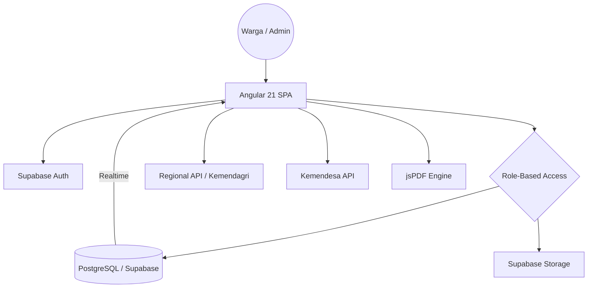

# Technical Blueprint - DigiWarga

**System Name:** DigiWarga (Sistem Informasi Kependudukan Digital)  
**Architecture Style:** Modern Serverless Single Page Application (SPA)  
**Backend:** Supabase (PostgreSQL + PostgREST + Auth + Storage)
**Version:** 2.0.0 (Royal Azure Edition)

---

## 1. Technology Stack
- **Framework**: Angular 21 (High-performance Signals reactivity)
- **Language**: TypeScript 5.x
- **Backend**: Supabase (PostgreSQL 16+)
  - **Authentication**: JWT-based Secure Auth with RBAC.
  - **Realtime**: PostgreSQL CDC via Broadcast Channels.
- **API External Integrations**:
  - **Regional API**: Kemendagri-compliant (wilayah.id) + Fallback emsifa.
  - **Village Info**: Kemendesa (IDM & Financial Integration).
- **Styling**: Vanilla CSS "Royal Azure" Design System (Light-mode, Glassmorphism, 8px Spacing).
- **Reporting**: jsPDF AutoTable for Kemendagri-standard documentation.

## 2. Infrastructure Architecture


## 3. Data Architecture (PostgreSQL)

### Table: `profiles`
Extended user metadata.
- `role`: (admin, petugas, warga) - Controls layout visibility.

### Table: `residents`
Main population registry (Primary Key: `nik`).
- Strict 16-digit validation.
- Real-time status tracking (HIDUP, MATI, PINDAH).

### Table: `families`
Family card (KK) master data.
- Linked via `kk_number` to multiple residents.
- Stores hierarchical regional codes (Province to Village).

### Table: `village_config`
System-wide branding and official metadata.
- Dynamic IDM status from Kemendesa sync.
- Used for official letter headers.

## 4. Key Design System: "Royal Azure"

### A. Color Palette (High-Contrast Daylight)
- **Text Main**: `#000000` (Pure Black for extreme legibility).
- **Primary**: `#2563eb` (Royal Azure Blue).
- **Secondary**: `#7c3aed` (Silk Purple).
- **Background**: `#f1f5f9` (Deep Slate Light).

### B. Spacing & Geometry
- **Standard**: 8px Multiplier System (`--space-1` to `--space-10`).
- **Corner Radius**: `1.5rem` (macOS-inspired super-ellipses).
- **Glassmorphism**: 40px Blur with white-path reflection edges (1px top-border).

### C. Motion & Easing
- **Apple Ease**: `cubic-bezier(0.32, 0.72, 0, 1)` for natural transitions.
- **Spring**: `cubic-bezier(0.34, 1.56, 0.64, 1)` for interactive elements.

## 5. UI/UX Principles
1. **Above the Fold**: All critical administrative metrics must be visible at 720px height (Tablet Landscape).
2. **High Legibility**: Use of `Outfit` typography with strict black/slate hierarchy.
3. **Micro-indicators**: Live sync pulses (`pulse-dot`) to confirm data integrity.

## 6. Project Structure
```text
src/
├── app/
│   ├── models/        # Postgres interface types
│   ├── services/      # Logic (Supabase, PDF, Kemendagri)
│   ├── pages/         # Signal-powered components
│   │   ├── dashboard/ # Admin Metrics
│   │   ├── residents/ # Data Grid & Filtering
│   │   ├── analysis/  # Social Classification Algorithms
│   │   └── auth/      # Secure Entry
│   └── shared/        # UI Atoms
├── styles/            # "Royal Azure" Design Tokens (styles.scss)
```

---
**Lead Implementation : Antigravity AI | Original Architect : Roedy Rustan**
 Logos
```

---
**Developed By : Pandu Talenta Digital | Implementation By Roedy Rustan**
