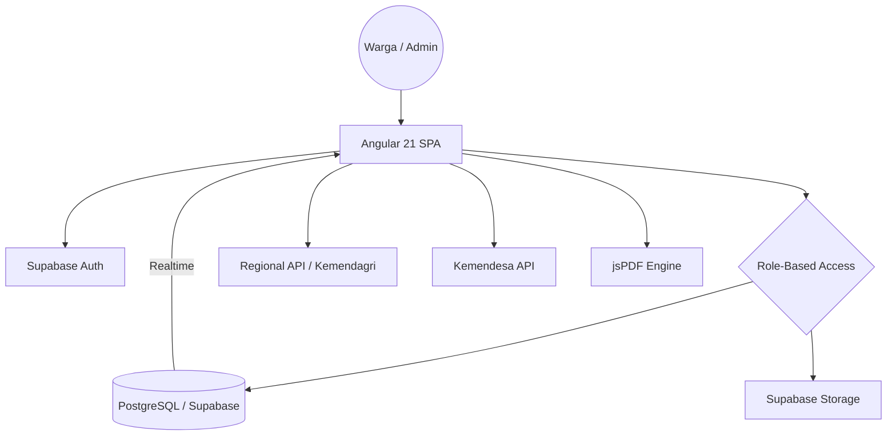

# Technical Blueprint - DigiWarga

**System Name:** DigiWarga (Sistem Informasi Kependudukan Digital)  
**Architecture Style:** Modern Serverless Single Page Application (SPA)  
**Backend:** Supabase (PostgreSQL + PostgREST + Auth + Storage)
**Version:** 1.5.0 (Modernized Infrastructure)

---

## 1. Technology Stack
- **Framework**: Angular 21 (Signals-based reactivity)
- **Language**: TypeScript 5.x
- **Backend**: Supabase
  - **Database**: PostgreSQL (Structured Relational Data)
  - **Authentication**: Supabase Auth (JWT based, Google OAuth, Email/Password)
  - **Storage**: Supabase Storage (S3-compatible bucket)
  - **Realtime**: PostgreSQL CDC (Change Data Capture) via Realtime Channels
- **API External Integrations**:
  - **Regional API**: Kemendagri-compliant (wilayah.id) with secondary fallback (emsifa.com).
  - **Village Info API**: Kemendesa (sid.kemendesa.go.id) for IDM & Financial data.
- **Reporting**: jsPDF, autoTable (Client-side PDF generation)
- **Styling**: Vanilla CSS with "Cyber-Luxe" design system (Glassmorphism & Neon accents)
- **Build Tool**: Vite (Next-gen frontend tooling)

## 2. Infrastructure Architecture


## 3. Data Architecture (PostgreSQL)

### Table: `profiles`
Extended user data linked to Supabase Auth.
- `id` (uuid, references auth.users)
- `email` (text)
- `role` (enum: admin, petugas, warga)
- `nik` (text, unique)
- `display_name` (text)
- `id_grup` (int)
- `created_at` (timestamp)

### Table: `residents`
Main population data.
- `nik` (text, primary key)
- `full_name` (text)
- `family_id` (text, references families.kk_number)
- `birth_place` (text)
- `birth_date` (date)
- `gender` (text)
- `occupation` (text)
- `relationship` (text)
- `religion` (text)
- `education` (text)
- `marital_status` (text)
- `created_at` (timestamp)

### Table: `families`
Family card (KK) data.
- `kk_number` (text, primary key)
- `head_name` (text)
- `address` (text)
- `rt_rw` (text)
- `province_code` (text)
- `regency_code` (text)
- `district_code` (text)
- `village_code` (text)
- `created_at` (timestamp)

### Table: `services`
Administrative request tracking.
- `id` (uuid, primary key)
- `nik` (text, references residents)
- `service_type` (text)
- `reason` (text)
- `attachments` (text[]): Array of document URLs.
- `letter_url` (text): Generated official letter URL.
- `status` (text: Pending, Processed, Completed, Rejected)
- `admin_note` (text)
- `processed_by` (uuid, references profiles)
- `created_at` (timestamp)

### Table: `village_config`
System-wide village metadata for letter headers & branding.
- `id` (uuid)
- `village_name` (text)
- `district_name` (text)
- `regency_name` (text)
- `province_name` (text)
- `village_head` (text)
- `village_head_nip` (text)
- `village_secretary` (text)
- `village_logo_url` (text)
- `idm_status` (text)
- `dana_desa` (bigint)

## 4. Key Algorithms & Logic

### A. Regional Cascading Dropdown
The system implements a Kemendagri-standard hierarchical selection:
1. **Fetch Provinces**: Initial load from `wilayah.id`.
2. **Fetch Regencies**: Triggered by Province selection (filter by `province_code`).
3. **Fetch Districts**: Triggered by Regency selection (filter by `regency_code`).
4. **Fetch Villages**: Triggered by District selection (filter by `district_code`).
5. **Fallback Logic**: If `wilayah.id` is unreachable, automatically switch to `emsifa.com` API to ensure 100% uptime.

### B. Smart Village Sync
Utilizes `KemendesaService` to automatically populate village metadata:
- **Pencarian**: Partial string search for village names.
- **Auto-Fill**: Once selected, the system fetches NIP, Head of Village, and Financial stats (IDM/Dana Desa) from Kemendesa open data.

### C. Realtime Data Sync
Uses Supabase Realtime Channels to eliminate the need for manual refreshes:
- Dashboard stats update instantly when a new resident is added.
- Service request status updates on the citizen portal as soon as an admin processes it.

## 5. UI/UX Design: "Cyber-Luxe"
- **Semantics**: Strict adherence to HTML5 semantic tags (`<header>`, `<main>`, `<footer>`, `<section>`).
- **Aesthetics**:
  - Deep Dark Theme (`#050505`) with High Contrast Neon Cyan accents.
  - Glassmorphism: Background blur and semi-transparent layers for a premium feel.
  - Micro-interactions: Smooth CSS transitions and state-aware signals.

## 6. Project Structure
```text
src/
├── app/
│   ├── models/        # Strict Type Definitions (Postgres interfaces)
│   ├── services/      # Business Logic (Supabase, Regional, PDF, Kemendesa)
│   ├── pages/         # Signal-powered View Components
│   │   ├── dashboard/
│   │   ├── residents/
│   │   ├── settings/
│   │   └── auth/
│   └── shared/        # Reusable UI Components & Pipes
├── styles/            # "Cyber-Luxe" Design System
└── assets/            # Static assets & Logos
```

---
**Developed By : Pandu Talenta Digital | Implementation By Roedy Rustan**
